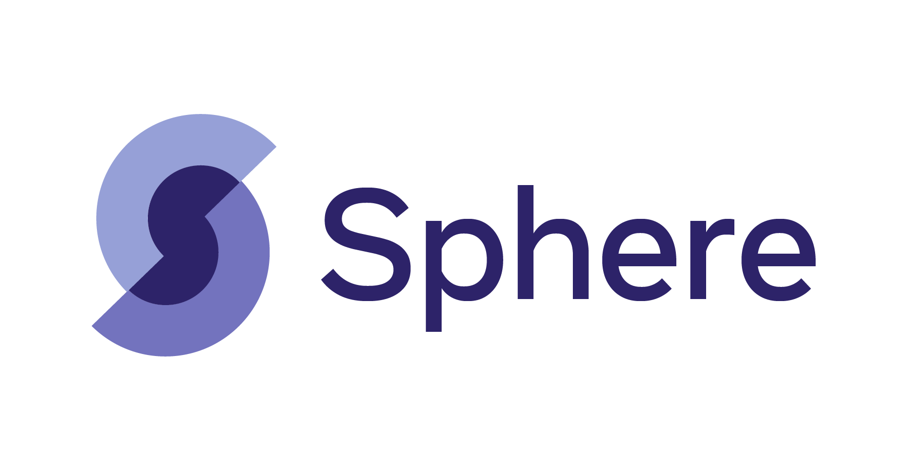

# Sphere


# About
In our paper [*The Web Is Your Oyster - Knowledge-Intensive NLP against a Very Large Web Corpus*](https://arxiv.org/abs/2112.09924) we propose to use a web corpus as a universal, uncurated and unstructured knowledge source for multiple KI-NLP tasks at once. 

We leverage an open web corpus coupled with strong retrieval baselines instead of a black-box, commercial search engine - an approach which facilitates transparent and reproducible research and opens up a path for future studies comparing search engines optimised for humans with retrieval solutions designed for neural networks.
We use a subset of [CCNet](https://github.com/facebookresearch/cc_net) covering 134M documents split into 906M passages as the web corpus which we call **Sphere**.

In this repository we open source indices of Sphere both for the sparse retrieval baseline, compatible with [Pyserini](https://github.com/castorini/pyserini), and our best dense model compatible with [distributed-faiss](https://github.com/facebookresearch/distributed-faiss). We also provide instructions on how to evaluate the retrieval performance for both standard and newly introduced retrieval metrics, using the [KILT](https://github.com/facebookresearch/KILT) API.


## Reference
If you use the content of this repository in your research, please cite the following:
```
@article{DBLP:journals/corr/abs-2112-09924,
  author    = {Aleksandra Piktus and Fabio Petroni
               and Vladimir Karpukhin and Dmytro Okhonko
               and Samuel Broscheit and Gautier Izacard
               and Patrick Lewis and Barlas Oguz
               and Edouard Grave and Wen{-}tau Yih
               and Sebastian Riedel},
  title     = {The Web Is Your Oyster - Knowledge-Intensive {NLP} against a Very
               Large Web Corpus},
  journal   = {CoRR},
  volume    = {abs/2112.09924},
  year      = {2021},
  url       = {https://arxiv.org/abs/2112.09924},
  eprinttype = {arXiv},
  eprint    = {2112.09924},
  timestamp = {Tue, 04 Jan 2022 15:59:27 +0100},
  biburl    = {https://dblp.org/rec/journals/corr/abs-2112-09924.bib},
  bibsource = {dblp computer science bibliography, https://dblp.org}
}
```

## Installation
```
git clone git@github.com:facebookresearch/Sphere.git
cd Sphere
conda create -n sphere -y python=3.7 && conda activate sphere
pip install -e .
```

## Index download
We open source pre-built Sphere indices:
- a Pyserini-compatible sparse BM25 index: [sphere_sparse_index.tar.gz](https://dl.fbaipublicfiles.com/sphere/sphere_sparse_index.tar.gz) - 775.6 GiB
- a distributed-faiss-compatible dense DPR index: [sphere_sparse_index.tar.gz](https://dl.fbaipublicfiles.com/sphere/sphere_dense_index.tar.gz) - 1.2 TiB

You can download and unpack respective index files directly e.g. via the browser of `wget`:
```
mkdir -p faiss_index

wget -P faiss_index https://dl.fbaipublicfiles.com/sphere/sphere_sparse_index.tar.gz
tar -xzvf faiss_index/sphere_sparse_index.tar.gz -C faiss_index

wget -P faiss_index https://dl.fbaipublicfiles.com/sphere/sphere_dense_index.tar.gz
tar -xzvf faiss_index/sphere_dense_index.tar.gz -C faiss_index
```

# Evaluation with [KILT](https://github.com/facebookresearch/KILT)
We implement the retrieval metrics introduced in the paper:
- the `answer-in-context@k`,
- the `answer+entity-in-context@k`,
- as well as the `entity-in-input` ablation metric

within the KILT repository. Follow instruction below to perform and evaluate retrieval on KILT tasks for both sparse and dense Sphere indices.

## KILT dependencies
```bash
pip install -e git+https://github.com/facebookresearch/KILT#egg=KILT
```

Download KILT data. Check out instructions in the [KILT](https://github.com/facebookresearch/KILT#download-the-data) repo for more details.
```bash
mkdir -p data
python src/kilt/scripts/download_all_kilt_data.py
python src/kilt/scripts/get_triviaqa_input.py
```

## Dense index
### Install dependencies
```bash
pip install -e git+https://github.com/facebookresearch/distributed-faiss#egg=distributed-faiss
pip install -e git+https://github.com/facebookresearch/DPR@multi_task_training#egg=DPR
pip install spacy==2.1.8
python -m spacy download en
```

### Launch `distributed-faiss` server
More details [here](https://github.com/facebookresearch/distributed-faiss#launching-servers-with-submitit-on-slurm-managed-clusters).
```bash
python src/distributed-faiss/scripts/server_launcher.py \
    --log-dir logs \
    --discovery-config faiss_index/disovery_config.txt \
    --num-servers 32 \
    --num-servers-per-node 4 \
    --timeout-min 4320 \
    --save-dir faiss_index/ \
    --mem-gb 500 \
    --base-port 13034 \
    --partition dev &
```
### Download assets
- The DPR_web model: [dpr_web_biencoder.cp](http://dl.fbaipublicfiles.com/sphere/dpr_web_biencoder.cp)
- The configuration file: [dpr_web_sphere.yaml](https://dl.fbaipublicfiles.com/sphere/dpr_web_sphere.yaml)
```bash
mkdir -p checkpoints
wget -P checkpoints http://dl.fbaipublicfiles.com/sphere/dpr_web_biencoder.cp

mkdir -p configs
wget -P configs https://dl.fbaipublicfiles.com/sphere/dpr_web_sphere.yaml
```

Subsequently update the following fields in the `dpr_web_sphere.yaml` configuration file:
```bash
n_docs: 100 # the number of documents to retrieve per query
model_file: checkpoints/dpr_web_biencoder.cp # path to the downloaded model file
rpc_retriever_cfg_file: faiss_index/disovery_config.txt # path to the discovery config file used when launching the distributed-faiss server
rpc_index_id: dense # the name of the folder contaning dense index partitions
```

### Execute retrieval
In order to perform retrieval from the dense index you first need to launch the distributed-faiss server as described above. You can control the KILT datasets you perform retrieval for by modifying respective config files, e.g. `src/kilt/configs/dev_data.json`.
```bash
python src/kilt/scripts/execute_retrieval.py \
    --model_name dpr_distr \
    --model_configuration configs/dpr_web_sphere.yaml \
    --test_config src/kilt/kilt/configs/dev_data.json \
    --output_folder output/dense/
```
## Sparse index
### Install dependencies
Our sparse index relies on Pyserini, and therfore requires [an install of Java 11](https://github.com/castorini/pyserini#installation) to be available on the machine.
```bash
pip install jnius
pip install pyserini==0.9.4.0
```

 Next, download the following file:
- The configuration file: [bm25_sphere.json](https://dl.fbaipublicfiles.com/sphere/bm25_sphere.json)
```bash
mkdir -p configs
wget -P configs https://dl.fbaipublicfiles.com/sphere/bm25_sphere.json
```

Subsequently update the following field in the `bm25_sphere.json` configuration file:
```bash
"k": 100, # the number of documents to retrieve per query
"index": "faiss_index/sparse", # path to the unpacked sparse BM25 index
```

### Execute retrieval
```
python src/kilt/scripts/execute_retrieval.py \
    --model_name bm25 \
    --model_configuration configs/bm25_sphere.json \
    --test_config src/kilt/kilt/configs/dev_data.json \
    --output_folder output/sparse/
```

## Retrieval evaluation
```bash
python src/kilt/kilt/eval_retrieval.py \
    output/$index/$dataset-dev-kilt.jsonl \ # retrieval results - the output of running eval_retrieval.py
    data/$dataset-dev-kilt.jsonl \ # gold KILT file (available for download in the KILT repo)
    --ks="1,20,100"
```


# Standalone dense index usage
Install and launch `distributed-faiss`. More details on the `distributed-faiss` server [here](https://github.com/facebookresearch/distributed-faiss#launching-servers-with-submitit-on-slurm-managed-clusters).

```bash
pip install -e git+https://github.com/facebookresearch/distributed-faiss#egg=distributed-faiss
```

```bash
python src/distributed-faiss/scripts/server_launcher.py \
    --log-dir logs/ \
    --discovery-config faiss_index/disovery_config.txt \
    --num-servers 32 \
    --num-servers-per-node 4 \
    --timeout-min 4320 \
    --save-dir faiss_index/ \
    --mem-gb 500 \
    --base-port 13034 \
    --partition dev &
```

## Standalone client example
For a minimal working example of querying the Sphere dense index, we propose to interact with the DPR model via `transformers` API. To that end please install dependencies:
```bash
pip install transformers==4.17.0
```
Using the DPR checkpoing with transformers API requires reformatting the original checkpoint. You can download and unpack the `transformers`-complatible DPR_web query encoder here:
- [dpr_web_query_encoder_hf.tar.gz](https://dl.fbaipublicfiles.com/sphere/dpr_web_query_encoder_hf.tar.gz)

```bash
mkdir -p checkpoints
wget -P checkpoints https://dl.fbaipublicfiles.com/sphere/dpr_web_query_encoder_hf.tar.gz
tar -xzvf checkpoints/dpr_web_query_encoder_hf.tar.gz -C checkpoints/
```
Alternatively, you can convert the [`dpr_web_biencoder.cp`](http://dl.fbaipublicfiles.com/sphere/dpr_web_biencoder.cp) model yourself using [available scripts](https://github.com/huggingface/transformers/blob/main/src/transformers/models/dpr/convert_dpr_original_checkpoint_to_pytorch.py).


Then you can run the interactive demo:
```bash
python scripts/sphere_client_demo_hf.py \
    --encoder checkpoints/dpr_web_query_encoder_hf \
    --discovery-config faiss_index/disovery_config.txt \
    --index-id dense
```

# License
`Sphere` is released under the CC-BY-NC 4.0 license. See the `LICENSE` file for details.
